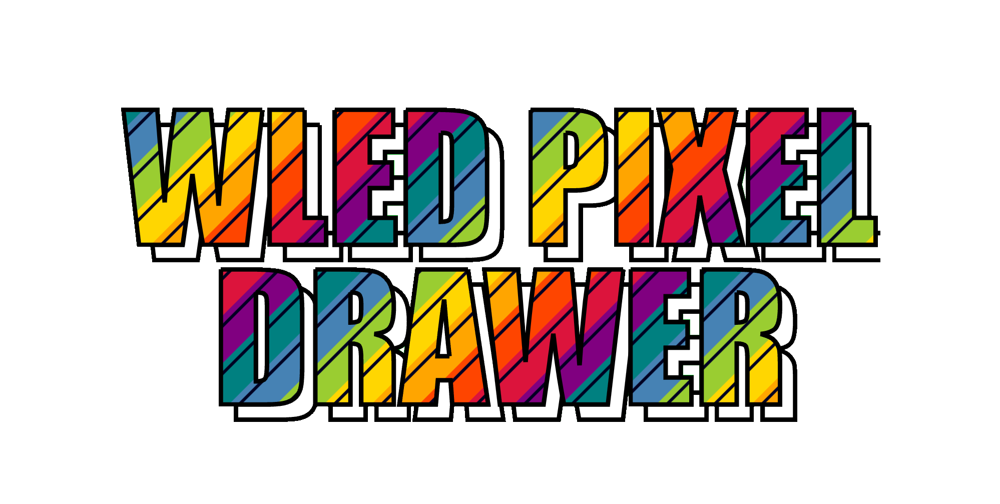
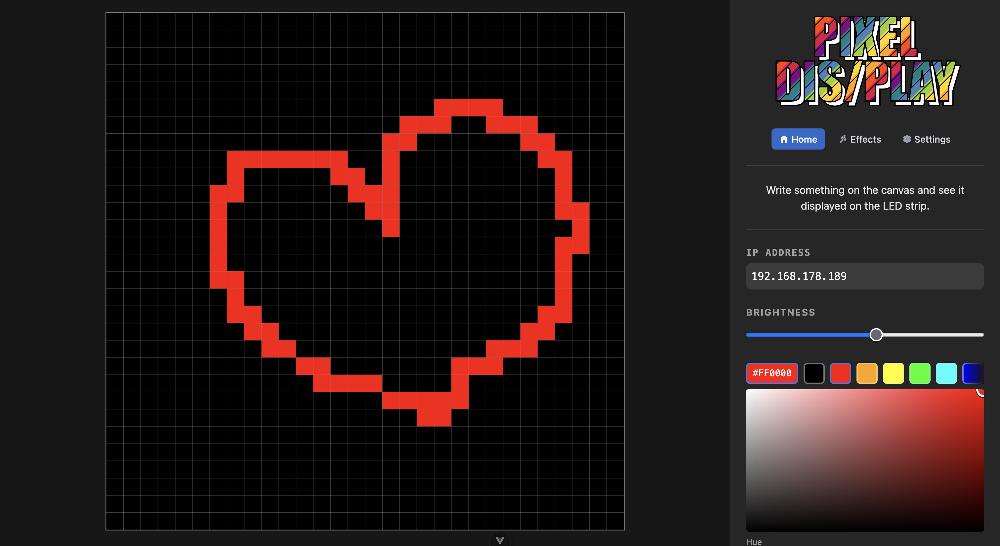

# WLED 2D Pixel Matrix Drawer

> Vue.js 3 frontend to draw and control wled 2d pixel matrices projects via wled’s json api.

---

The idea behind this project is to run this frontend on an ESP32 (or ESP8266) chip during the captive portal of wled. This way you can draw on the pixel matrix directly when a user connects to the WLED-AP device.

This project is a git submodule of my other forked repo [WLED-With-2D-Pixel-Drawer](https://github.com/Coderwelsch/WLED-With-2D-Pixel-Drawer) where this frontend is shown on the esp captive portal (when you connect to the esp wifi).

## Features

- simple canvas to draw pixel matrix
- controls for brightness and ip / hostname of the wled device 
- frontend updates esp via wled json api



## Installation

### Clone Repository

```bash
git clone git@github.https://github.com/Coderwelsch/wled-2d-pixel-drawer.git

cd wled-2d-pixel-drawer

yarn install

cp .env.example .env
```

### Configure Environment Variables

Copy the `.env.example` file to `.env` and configure the environment variables
according to your setup and amount of pixels etc.

```bash
# Disables the brightness input field
VITE_DISABLE_BRIGHTNESS_CHANGE=false
VITE_DEFAUT_BRIGHTNESS=50

# Disables the ip / hostname input field
VITE_DISABLE_HOSTNAME_CHANGE=false
# Default hostname of the ESP32 when running on the esp chip in the captive portal
VITE_DEFAULT_HOSTNAME=4.3.2.1

# The width and height of the matrix in pixels
VITE_MATRIX_WIDTH=30
VITE_MATRIX_HEIGHT=30
```

## Build Project

The build will output only one big html file containing all the css and js code inlined for easier deployment on the esp chip.

To build the project run:

```bash
yarn build
```

---


## Credits

Thanks for the awesome work of [yoksel](https://github.com/yoksel) and her beautiful svg animation skills. The headline animation is taken from her [Animated text with Snapsvg](https://codepen.io/yoksel/pen/yNJYyE) codepen project. 

[WLED](https://github.com/Aircoookie/WLED) is also one of the coolest open source projects I know. Thanks to the developers for their great work!